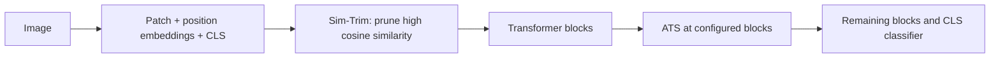
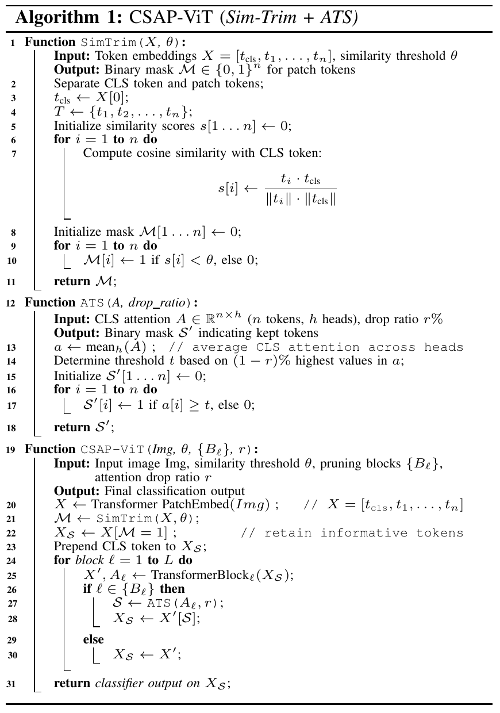
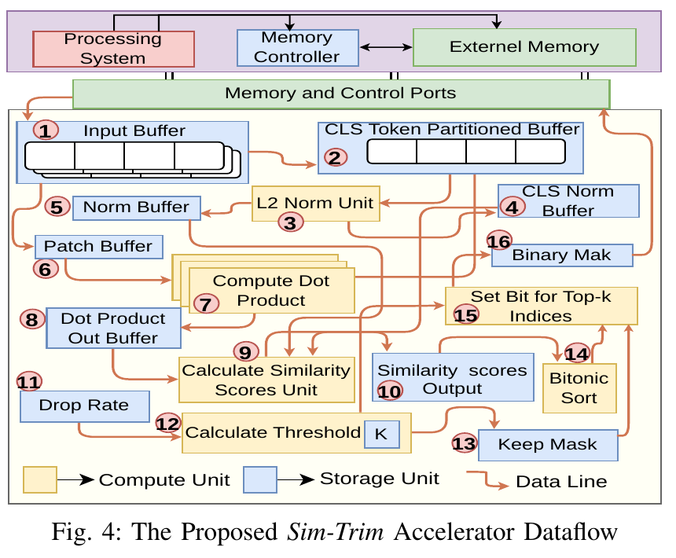

# CSAP-ViT: Cascade Similarity–Attention Pruning for Accelerating ViTs on FPGA

**Akshansh Yadav and Palash Das** · Department of Computer Science and Engineering, IIT Jodhpur

A configuration-driven PyTorch implementation of **Sim-Trim + Attention-based Token Selection (ATS)**, with original research notebooks, Python exports, and saved experimental results.

**Start here:** [setup](#1-set-up-the-environment) → [external data](#2-prepare-external-evaluation-data) → [run the full comparison](#3-run-the-complete-baseline-and-pruning-comparison) → [understand pruning](#pruning-configuration).

## How it works

1. Embed the image patches, prepend CLS, and add positional embeddings.
2. **Sim-Trim:** compute cosine similarity between CLS and each patch. Remove the most similar patches before the encoder; retain CLS.
3. Run transformer blocks. At configured blocks, **ATS** averages the CLS attention row across heads and removes the least-attended patches after the full block.
4. Normalize the remaining sequence and classify with CLS.



The following images are extracted directly from the supplied manuscript, with source details in [assets/README.md](assets/README.md).

<details>
<summary>Paper Algorithm 1: CSAP-ViT</summary>



</details>



The dataflow image describes the paper's hardware design. This repository supplies software experiments; no FPGA/HLS/RTL source was present in the supplied folder.

## 1. Set up the environment

From the repository root, use Python 3.10:

```bash
python3.10 -m venv .venv
source .venv/bin/activate
python -m pip install --upgrade pip
python -m pip install -r requirements.txt
python -m unittest discover -s tests -v
```

Nine tests cover pruning, baseline equivalence, configurations, and a complete repeatable evaluation on temporary synthetic images. They run on CPU without ImageNet or weight downloads. The synthetic accuracy is only a software test, not a research result.

Direct dependencies are pinned to locally tested versions. For a CPU-only PyTorch installation, install the pinned PyTorch/torchvision CPU wheels before the requirements:

```bash
python -m pip install torch==2.3.1 torchvision==0.18.1 --index-url https://download.pytorch.org/whl/cpu
python -m pip install -r requirements.txt
```

For notebooks:

```bash
python -m pip install -r requirements-notebooks.txt
jupyter lab notebooks/quickstart.ipynb
```

GPU execution needs a compatible PyTorch CUDA build and driver. The tests were executed on CPU; GPU accuracy and performance were not measured during repository preparation.

## 2. Prepare external evaluation data

ImageNet and pretrained weights are **not bundled**. Keep data outside the repository:

```text
/external/imagenet/val/
    n01440764/
        image1.JPEG
    n01443537/
        image2.JPEG
```

The evaluator expects one directory per synset. If the original validation images are flat, organize them using the official validation labels before running. Obtain the dataset and labels separately.

Provide an external JSON mapping classifier indices to synset and label:

```json
{
  "0": ["n01440764", "tench"],
  "1": ["n01443537", "goldfish"]
}
```

The example shows only two entries; use the correct mapping for all classes in your evaluation. The explicit mapping supports subsets without confusing `ImageFolder` indices with pretrained classifier indices. A subset is useful for testing but does not reproduce full validation accuracy.

Set paths in your shell:

```bash
export IMAGENET_VAL=/absolute/path/to/imagenet/val
export IMAGENET_CLASS_INDEX=/absolute/path/to/imagenet_class_index.json
```

## 3. Run the complete baseline and pruning comparison

This runs **baseline → Sim-Trim only → CSAP 15/15/15/15**, using the same model weights and dataset:

```bash
python -m tools.run_suite \
  --size base \
  --data "$IMAGENET_VAL" \
  --class-index "$IMAGENET_CLASS_INDEX" \
  --device cuda:0 --batch-size 16 \
  --output-dir results/base_reference
```

Use `--device cpu` without a GPU. Lower the batch size if memory is limited. Results directories must be new, preventing accidental mixing or overwriting of runs.

To run the **baseline, Sim-Trim, and all 12 cascade schedules from Table I**:

```bash
python -m tools.run_suite \
  --size base --all \
  --data "$IMAGENET_VAL" \
  --class-index "$IMAGENET_CLASS_INDEX" \
  --device cuda:0 --batch-size 16 \
  --output-dir results/base_all_schedules
```

Repeat with `--size small` or `--size large` and a different output directory. A complete suite evaluates the dataset 14 times and can take substantial time.

Outputs:

```text
results/base_reference/
    baseline.json                 # Accuracy, config, versions, weight hash, token counts
    baseline.dataset.json         # Relative image paths, labels, sizes, SHA-256 hashes
    simtrim_15.json
    simtrim_15.dataset.json
    csap_15_15_15_15.json
    csap_15_15_15_15.dataset.json
    summary.csv                   # Top-1, top-5, accuracy loss from baseline
    accuracy.png                  # Plot of newly measured accuracy
```

The suite checks that dataset and weight fingerprints agree across comparisons. Each result records preprocessing, seed, device, versions, resolved pretrained configuration, and block-input token counts. Timing includes data loading/logging and is not an FPGA or optimized throughput measurement.

## 4. Run or customize one configuration

```bash
python -m similarity_pruning.evaluate \
  --config configs/base/csap_15_15_15_15.json \
  --data "$IMAGENET_VAL" \
  --class-index "$IMAGENET_CLASS_INDEX" \
  --device cuda:0 \
  --output results/custom_run.json
```

Configuration example:

```json
{
  "model": "vit_base_patch16_224.augreg2_in21k_ft_in1k",
  "method": "csap",
  "embedding_drop": 0.15,
  "block_drop": 0.15,
  "blocks": [3, 6, 9],
  "drop_least_similar": false,
  "batch_size": 16,
  "workers": 0,
  "seed": 0,
  "preprocessing": "timm",
  "hash_images": true
}
```

Command-line arguments override saved configuration values. For example, add `--embedding-drop 0.20 --block-drop 0.25 --batch-size 8`. Unknown configuration keys and invalid rates are rejected.

The first evaluation downloads timm weights. To use an exact offline checkpoint, pass `--checkpoint /external/weights/model.pth` to either command. It must be a trusted timm-compatible state dictionary matching the configured architecture. The evaluator hashes the loaded model state, so comparisons identify the actual weights rather than relying only on model names.

## Pruning configuration

| Setting | Meaning |
|---|---|
| `embedding_drop` | Fraction of patch tokens removed by Sim-Trim before the encoder |
| `block_drop` | Fraction of remaining patches removed after each selected block |
| `blocks` | Zero-based block indices; CLS is never dropped |
| `method: csap` | Sim-Trim followed by attention-based selection |
| `method: similarity` | Similarity-based pruning also at selected later blocks, for ablations |
| `drop_least_similar` | Reverses similarity selection only; ATS still keeps high-attention patches |
| `preprocessing: timm` | Tagged model's resize/crop/normalization, recommended for the reference evaluation |
| `preprocessing: legacy-nearest` | Original floor-coordinate nearest resize + ToTensor, without normalization |
| `hash_images` | Include image-content hashes in the dataset fingerprint |

42 saved configurations cover these models:

| Size | Explicit pretrained model | ATS indices |
|---|---|---|
| Small | `vit_small_patch16_224.augreg_in21k_ft_in1k` | 3, 6, 9 |
| Base | `vit_base_patch16_224.augreg2_in21k_ft_in1k` | 3, 6, 9 |
| Large | `vit_large_patch16_224.augreg_in21k_ft_in1k` | 6, 12, 18 |

These explicit weight tags are selected for reproducible new runs. The original paper's exact tags were not established; do not assume equivalence to its training checkpoints.

For `N` remaining patches, each stage removes `floor(N * rate)`. For a 224×224 image and 16×16 patches, a 15/15/15/15 Base run retains **196 → 167 → 142 → 121 → 103 patches**, plus CLS. Each rate applies to the remaining tokens, not the original 196. Stable sorting resolves ties and preserves retained token order.

Sim-Trim-only: use `configs/base/simtrim_15.json`. Baseline: use `configs/base/baseline.json`. Opposite-similarity ablation: add `--drop-least-similar`. Fixed-point quantization and token merging remain in the historical notebooks; the portable evaluator runs **FP32**, with TF32 disabled.

## What is reproducible here?

The supplied workflow fixes configuration, weight identity, data identity, preprocessing, seed, and direct dependencies. It enables repeatable baseline/pruning comparisons and reports the settings needed to repeat them. Deterministic operations are requested; numerical identity across different hardware or dependency stacks is not guaranteed.

**Exact paper-number reproduction has not been demonstrated.** No full ImageNet run was executed during preparation. Differences include historical preprocessing, threshold/tie behavior, unrecorded weight versions, and quantization. The cleaned code fixes batch-shape issues and uses fixed-count rank selection. [Method details](docs/method.md) explain these differences. Legacy preprocessing is available for controlled comparisons but is not, by itself, a complete paper-reproduction mode.

## Paper-reported results

| Model | Schedule | Top-1 accuracy (%) | GOPs | Reported savings (%) |
|---|---|---:|---:|---:|
| Base | Baseline | 83.32 | 17.571 | 0 |
| Base | 15/15/15/15 | 83.08 | 12.16 | 30.80 |
| Base | 30/25/25/25 | 81.29 | 8.79 | 50.00 |

Source: supplied manuscript, Table I. The 15/15/15/15 loss is **0.24 percentage points**. Hardware figures of **21.30 FPS**, **5.25 FPS/W**, and **4.05 W** are manuscript-reported and are not reproduced by this Python code. See [results provenance](docs/results.md).

## Historical code, notebooks, and results

| Path | Contents |
|---|---|
| `similarity_pruning/` | Maintained runnable reference implementation |
| `configs/` | 42 explicit evaluation configurations |
| `tools/run_suite.py` | Baseline/pruning comparisons, CSV, plot |
| `notebooks/quickstart.ipynb` | Guided synthetic pruning example and evaluation instructions |
| `experiments/` | 1,508 original notebooks, 990 text result files, two vector plots |
| `python_exports/` | Python exports of every historical notebook |
| `docs/archive_index.md` | Experiment inventory |
| `docs/archive_manifest.json` | Original hashes and transformations |
| `docs/logged_results.csv` | Last matching records from 965 historical logs |
| `docs/excluded_files.json` | Excluded source files and reasons |

Original names and duplicates are retained for provenance. Review legacy cells before execution: they contain absolute paths, fixed CUDA device indices, file writes, generation loops, and IPython commands. All exports passed syntax checks; that does not establish runtime correctness.

Notebook rich visual outputs and attachments were removed from publication copies to exclude embedded dataset samples and reduce file sizes. Source and textual outputs are preserved. Unreviewed raster and embedded-raster figures remain excluded; original workspace files are unchanged. The two README figures are specifically extracted diagrams from the manuscript. Datasets, downloaded weights, and the full PDF are not published here.

## Attribution

Use the title and authors at the top when referring to this manuscript. Final venue, DOI, and bibliographic metadata have not been verified. No software license has been selected; public visibility alone does not grant an open-source license.
